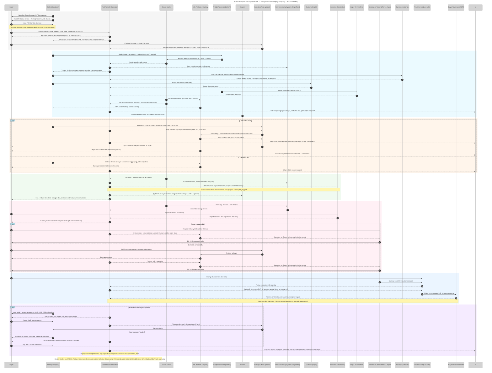

```mermaid
---
config:
  theme: base
  themeVariables:
    actorBkg: "lightgrey"
    actorBorder: "darkgrey"
    loopTextColor: "black"
    labelBoxBkgColor: "lightblue"
    labelBoxBorderColor: "grey"
---
sequenceDiagram
    autonumber
    title Ocean Transport with Negotiable eBL — 7 Steps Orchestrated (Buy–Ship–Pay + Port + Last-Mile)

    %% Participants
    participant Buyer as Buyer
    participant Seller as Seller (Consignor)
    participant TV as TradeVeris Orchestration
    participant Carrier as Ocean Carrier
    participant eBL as eBL Platform / Registry
    participant FF as Freight Forwarder (Seller's)
    participant Insurer as Insurer
    participant Bank as Bank (LC/Aval, optional)
    participant PCS as Port Community System (Origin/Dest)
    participant CustO as Customs (Origin)
    participant CustD as Customs (Destination)
    participant PortO as Origin Terminal/Port
    participant PortD as Destination Terminal/Port & Agent
    participant Survey as Surveyor (optional)
    participant Truck as Truck Carrier (Last Mile)
    participant WH as Buyer Warehouse / CFS

    %% --------------------------------------------------------
    %% Step 1 — BUY: Contract & Identity Binding
    %% --------------------------------------------------------
    rect rgb(245,245,245)
    Seller->>Buyer: Negotiate Sales Contract (CIF for example)
    Seller->>Buyer: Send Proforma Invoice + Terms (Incoterms, title clause)
    Buyer->>Seller: Issue PO / Confirm Contract
    Note over Buyer,Seller: Title governed by contract + negotiable eBL control (not by Incoterms)

    Buyer->>TV: Onboard parties (Buyer, Seller, Carrier, Bank, Insurer) with vLEI/LPID
    TV-->>Buyer: Bind roles (OOR/ECR), delegations (PoA), SLA & policy pack
    TV-->>Seller: Policy: who can issue/endorse eBL, evidence rules, compliance hooks
    Buyer->>Bank: (Optional) Arrange LC/Aval / OA terms
    Bank-->>TV: Register financing conditions & required docs (eBL, Invoice, Insurance)
    end

    %% --------------------------------------------------------
    %% Step 2 — SHIP: Booking, Stuffing, Export, eBL Issuance
    %% --------------------------------------------------------
    rect rgb(235,250,255)
    Seller->>FF: Book shipment, provide CI, Packing List, COO (if needed)
    FF->>Carrier: Booking request (vessel/voyage) + VGM + cut-offs
    Carrier-->>TV: Booking confirmation event
    TV-->>PCS: Sync vessel schedule & milestones
    TV-->>Seller: Trigger: Stuffing readiness, capture container numbers + seals
    Seller->>Survey: (Optional) Pre-load survey / cargo condition images
    Survey-->>TV: Upload evidence, bind to shipment (operational provenance)

    Seller->>CustO: Export declaration (via broker)
    CustO-->>TV: Export clearance status
    FF->>PortO: Gate-in containers (verified by PCS)
    PortO-->>TV: Gate-in event + load list

    Carrier->>eBL: Issue negotiable eBL (to order) after On-Board
    Carrier->>TV: On-Board event + eBL metadata (immutable content hash)
    eBL-->>Seller: Initial control/holding (not the Carrier)
    TV-->>All: Evidence package (timestamps, credential refs, QSeal/QES if applied)
    Insurer-->>Seller: Insurance Certificate (CIF) (reference stored in TV)
    end

    %% --------------------------------------------------------
    %% Step 3 — FINANCE: Endorsements, Pledges, Document Checks
    %% --------------------------------------------------------
    rect rgb(255,245,235)
    alt LC/Aval Financing
        Seller->>Bank: Present docs (eBL control, Commercial Invoice, Insurance Cert)
        TV-->>Bank: Verify identities + policy conditions met (vLEI/LPID, revocation)
        Bank->>eBL: Take pledge / obtain endorsement from Seller (title/control event)
        eBL-->>Bank: Bank controls eBL (chain-of-title update)
        TV-->>All: Record endorsement/pledge (legal provenance, content unchanged)
        Bank->>Buyer: (Upon conditions met) Endorse eBL to Buyer
        eBL-->>Buyer: Buyer now controls eBL (title/control passes)
        TV-->>All: Evidence: signed endorsement events + timestamps
    else Open Account
        Seller->>eBL: Endorse directly to Buyer per contract trigger (e.g., after departure)
        eBL-->>Buyer: Buyer gains control (title/control passes)
        TV-->>All: Chain-of-title event recorded
    end
    end

    %% --------------------------------------------------------
    %% Step 4 — EN ROUTE: Compliance & Selective Data Sharing
    %% --------------------------------------------------------
    rect rgb(240,250,240)
    Carrier-->>TV: Departure / Transshipment / ETA updates
    TV-->>PCS: Publish milestones, alert stakeholders per policy
    TV-->>CustD: Pre-arrival security/manifest data (purpose-limited fields only)
    Note over TV,CustD: Selective data share: minimum data, time/purpose scoped, fully logged
    TV-->>Insurer: (Optional) Send premium/coverage confirmations (no full doc exposure)
    TV-->>Buyer: ETA - X days: Checklist—charges due, endorsement ready, surrender window
    end

    %% --------------------------------------------------------
    %% Step 5 — ARRIVE: Port, Customs, Presentation & Surrender
    %% --------------------------------------------------------
    rect rgb(255,240,245)
    Carrier->>PCS: Discharge manifest + arrival notice
    PCS-->>TV: Arrival & discharge events
    Buyer->>CustD: Import declaration (via broker)
    CustD-->>TV: Import clearance status (selective data only)

    TV-->>Buyer: Validate pre-release conditions (fees paid, right holder identified)
    alt Buyer controls eBL
        Buyer->>PortD: Request Delivery Order (DO) / Release
        TV-->>eBL: Orchestrate e-presentation/e-surrender (person entitled under doc)
        eBL-->>PortD: Surrender confirmed, release authorization issued
        PortD->>Buyer: DO / Release confirmation
    else Bank still controls eBL
        Buyer->>Bank: Fulfil payment/conditions, request endorsement
        Bank->>eBL: Endorse to Buyer
        eBL-->>Buyer: Buyer gains control
        TV-->>eBL: Proceed with e-surrender
        eBL-->>PortD: Surrender confirmed, release authorization issued
        PortD->>Buyer: DO / Release confirmation
    end
    end

    %% --------------------------------------------------------
    %% Step 6 — DELIVER: Gate-Out & Last-Mile to Buyer
    %% --------------------------------------------------------
    rect rgb(235,245,255)
    Buyer->>Truck: Arrange door delivery (last-mile)
    PortD->>Truck: Gate-out upon DO + customs cleared
    Truck-->>TV: Pickup event, last-mile tracking
    TV-->>Truck: (Optional) Generate eCMR for last-mile (policy: Buyer as consignee)
    Truck->>WH: Deliver cargo, capture PoD (photos, geostamp)
    WH-->>TV: Receipt confirmation, any variance/exception logged
    Note over TV,WH: Operational provenance: PoD, survey, variance do not alter eBL legal record
    end

    %% --------------------------------------------------------
    %% Step 7 — PAY: Acceptance, Settlement & Audit
    %% --------------------------------------------------------
    rect rgb(245,235,255)
    alt eBoE / Documentary Acceptance
        Seller->>Buyer: Issue eBoE / request acceptance (vLEI OOR, QES optional)
        TV-->>Buyer: Policy: authorized signers only, revocation checks
        Buyer->>Seller: Accept eBoE (event triggers)
        TV-->>Bank: Trigger settlement / release pledge (if any)
        Bank->>Seller: Release funds
    else Open Account / Invoice
        Seller->>Buyer: Commercial Invoice (due date, references shipment)
        TV-->>Buyer: Due date reminder, dispute/variance workflow if needed
        Buyer->>Seller: Pay (TT) / confirm settlement
    end
    TV-->>All: Closeout: export audit pack (identities, policies, endorsements, surrender, timestamps)
    Note over TV: Legal provenance (title chain) kept separate from operational provenance (movement, PoD)
    end

    %% --------------------------------------------------------
    %% Cross-Cutting Controls (implicit throughout)
    %% --------------------------------------------------------
    Note over TV: Identity binding (vLEI/LPID), Policy enforcement, Event automation, Selective data sharing, Evidence & audit, Optional QES/QSeal via QTSP, Optional DLT hash anchoring
```