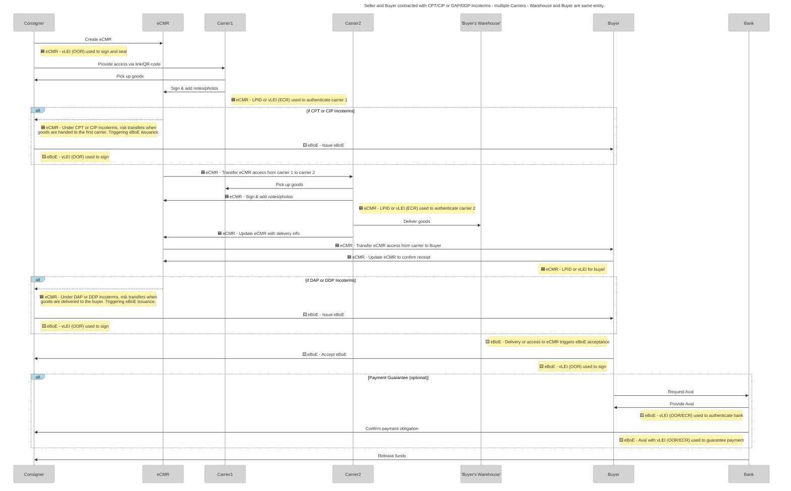

```mermaid
---
config:
  theme: base
  themeVariables:
    actorBkg: "lightgrey"
    actorBorder: "darkgrey"
    loopTextColor: "black"
    labelBoxBkgColor: "lightblue"
    labelBoxBorderColor: "grey"
---

sequenceDiagram
    title Seller and Buyer contracted with CPT/CIP or DAP/DDP Incoterms - multiple Carriers - Warehouse and Buyer are same entity.

    participant Consigner
    participant eCMR
    participant Carrier1
    participant Carrier2
    participant 'Buyer's Warehouse'
    participant Buyer
    participant Bank    

    %% eCMR Flow (Goods) with eBoE (Settlement)
    Consigner->>eCMR: Create eCMR
    Note right of Consigner: 🟦 eCMR - vLEI (OOR) used to sign and seal
    Consigner->>Carrier1: Provide access via link/QR-code

    Carrier1->>Consigner: Pick up goods
    Carrier1->>eCMR: Sign & add notes/photos
    Note right of Carrier1: 🟦 eCMR - LPID or vLEI (ECR) used to authenticate carrier 1

    %% CPT or CIP Incoterms
    alt if CPT or CIP Incoterms
        eCMR-->>Consigner:
        Note right of Consigner: 🟦 eCMR - Under CPT or CIP Incoterms, risk transfers when<br>goods are handed to the first carrier. Triggering eBoE issuance.
        Consigner->>Buyer: 🟨 eBoE - Issue eBoE
        Note right of Consigner: 🟨 eBoE - vLEI (OOR) used to sign
    end

    %% Transfer Goods
    eCMR->>Carrier2: 🟦 eCMR - Transfer eCMR access from carrier 1 to carrier 2
    Carrier2->>Carrier1: Pick up goods
    Carrier2->>eCMR: 🟦 eCMR - Sign & add notes/photos
    Note right of Carrier2: 🟦 eCMR - LPID or vLEI (ECR) used to authenticate carrier 2

    %% Delivery at Buyer's Warehouse
    Carrier2->>'Buyer's Warehouse': Deliver goods
    Carrier2->>eCMR: 🟦 eCMR - Update eCMR with delivery info
    eCMR->>Buyer: 🟦 eCMR - Transfer eCMR access from carrier to Buyer
    Buyer->>eCMR: 🟦 eCMR - Update eCMR to confirm receipt
    Note left of Buyer: 🟦 eCMR - LPID or vLEI for buyer

    %% DAP or DPP Incoterms
    alt if DAP or DDP Incoterms
        eCMR-->>Consigner:
        Note right of Consigner: 🟦 eCMR - Under DAP or DDP Incoterms, risk transfers when<br>goods are delivered to the buyer. Triggering eBoE issuance.
        Consigner->>Buyer: 🟨 eBoE - Issue eBoE
        Note right of Consigner: 🟨 eBoE - vLEI (OOR) used to sign
    end

    Note left of Buyer: 🟨 eBoE - Delivery or access to eCMR triggers eBoE acceptance
    Buyer->>Consigner: 🟨 eBoE - Accept eBoE
    Note left of Buyer: 🟨 eBoE - vLEI (OOR) used to sign

    %% Settlement Flow via bank
    alt Payment Guarantee (optional)
        Buyer->>Bank: Request Aval
        Bank->>Buyer: Provide Aval
        Note left of Bank: 🟨 eBoE - vLEI (OOR/ECR) used to authenticate bank
        Bank->>Consigner: Confirm payment obligation
        Note left of Bank: 🟨 eBoE - Aval with vLEI (OOR/ECR) used to guarantee payment
    end
    Bank->>Consigner: Release funds    
```