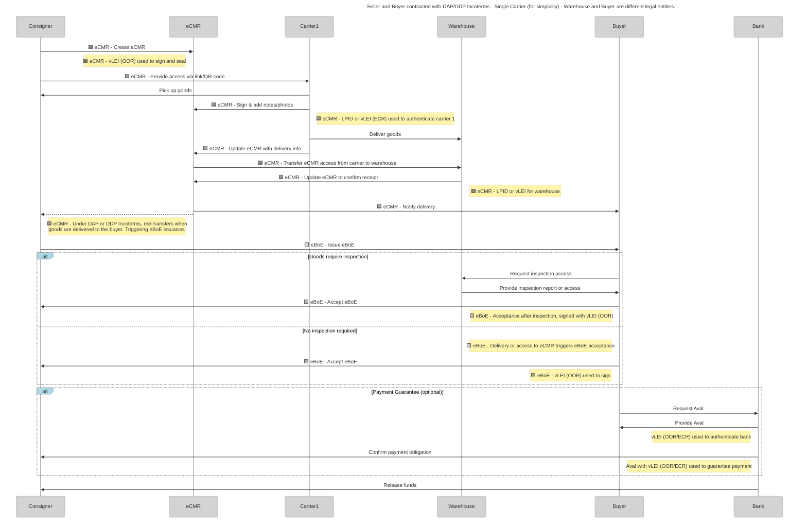

```mermaid
---
config:
  theme: base
  themeVariables:
    actorBkg: "lightgrey"
    actorBorder: "darkgrey"
    loopTextColor: "black"
    labelBoxBkgColor: "lightblue"
    labelBoxBorderColor: "grey"
---

sequenceDiagram

    title Seller and Buyer contracted with DAP/DDP Incoterms - Single Carrier (for simplicity) - Warehouse and Buyer are different legal entities.

    participant Consigner
    participant eCMR
    participant Carrier1
    participant Warehouse
    participant Buyer
    participant Bank    

    %% eCMR Flow (Goods) with eBoE (Settlement)
    Consigner->>eCMR: 🟦 eCMR - Create eCMR
    Note left of eCMR: 🟦 eCMR - vLEI (OOR) used to sign and seal
    Consigner->>Carrier1: 🟦 eCMR - Provide access via link/QR-code

    Carrier1->>Consigner: Pick up goods
    Carrier1->>eCMR: 🟦 eCMR - Sign & add notes/photos
    Note right of Carrier1: 🟦 eCMR - LPID or vLEI (ECR) used to authenticate carrier 1

    %% Delivery at Independent Warehouse
    Carrier1->>Warehouse: Deliver goods
    Carrier1->>eCMR: 🟦 eCMR - Update eCMR with delivery info
    eCMR->>Warehouse: 🟦 eCMR - Transfer eCMR access from carrier to warehouse 
    Warehouse->>eCMR: 🟦 eCMR - Update eCMR to confirm receipt
    Note right of Warehouse: 🟦 eCMR - LPID or vLEI for warehouse
    eCMR->>Buyer: 🟦 eCMR - Notify delivery

    %% DAP or DDP Incoterms - risk transfers from consigner to buyer
    eCMR-->>Consigner:
    Note right of Consigner: 🟦 eCMR - Under DAP or DDP Incoterms, risk transfers when<br>goods are delivered to the buyer. Triggering eBoE issuance.
    Consigner->>Buyer: 🟨 eBoE - Issue eBoE

    %% Inspection Flow
    alt Goods require inspection
        Buyer->>Warehouse: Request inspection access
        Warehouse->>Buyer: Provide inspection report or access
        Buyer->>Consigner: 🟨 eBoE - Accept eBoE
        Note left of Buyer: 🟨 eBoE - Acceptance after inspection, signed with vLEI (OOR)
    else No inspection required
        Note left of Buyer: 🟨 eBoE - Delivery or access to eCMR triggers eBoE acceptance
        Buyer->>Consigner: 🟨 eBoE - Accept eBoE
        Note left of Buyer: 🟨 eBoE - vLEI (OOR) used to sign
    end

    %% Settlement Flow via bank
    alt Payment Guarantee (optional)
        Buyer->>Bank: Request Aval
        Bank->>Buyer: Provide Aval
        Note left of Bank: vLEI (OOR/ECR) used to authenticate bank
        Bank->>Consigner: Confirm payment obligation
        Note left of Bank: Aval with vLEI (OOR/ECR) used to guarantee payment
    end
    Bank->>Consigner: Release funds    
```