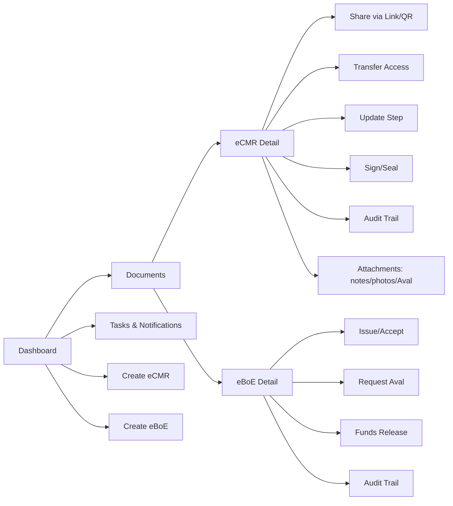

```mermaid

%% TopDown TD or Left-Right LR
flowchart LR

  A[Dashboard] --> B[Documents]
  A --> T[Tasks & Notifications]
  A --> S[Create eCMR]
  A --> E[Create eBoE]
  B --> D[eCMR Detail]
  B --> F[eBoE Detail]

  D --> Q[Share via Link/QR]
  D --> X[Transfer Access]
  D --> U[Update Step]
  D --> I[Sign/Seal]
  D --> L[Audit Trail]
  D --> V[Attachments: notes/photos/Aval]

  F --> P[Issue/Accept]
  F --> H[Request Aval]
  F --> R[Funds Release]
  F --> L2[Audit Trail] 

```