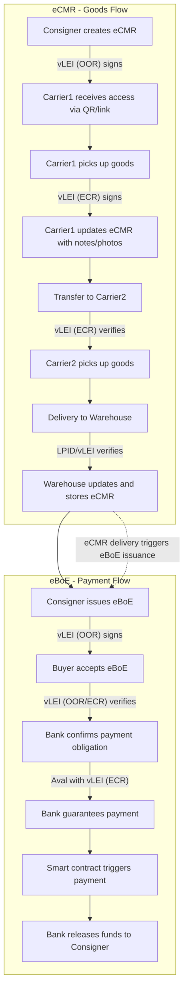

```mermaid

%% TopDown TD or Left-Right LR
flowchart TD
    subgraph eCMR_Flow [eCMR - Goods Flow]
        A[Consigner creates eCMR] -- vLEI (OOR) signs --> B[Carrier1 receives access via QR/link]
        B --> C[Carrier1 picks up goods]
        C -- vLEI (ECR) signs --> D[Carrier1 updates eCMR with notes/photos]
        D --> E[Transfer to Carrier2]
        E -- vLEI (ECR) verifies --> F[Carrier2 picks up goods]
        F --> G[Delivery to Warehouse]
        G -- LPID/vLEI verifies --> H[Warehouse updates and stores eCMR]
    end

    subgraph eBoE_Flow [eBoE - Payment Flow]
        I[Consigner issues eBoE] -- vLEI (OOR) signs --> J[Buyer accepts eBoE]
        J -- vLEI (OOR/ECR) verifies --> K[Bank confirms payment obligation]
        K -- Aval with vLEI (ECR) --> L[Bank guarantees payment]
        L --> M[Smart contract triggers payment]
        M --> N[Bank releases funds to Consigner]
    end

    H --> I
    H -. eCMR delivery triggers eBoE issuance .-> I
```