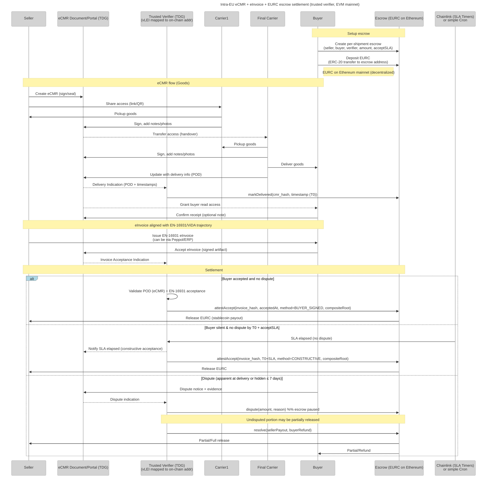

```mermaid
---
config:
  theme: base
  themeVariables:
    actorBkg: "lightgrey"
    actorBorder: "darkgrey"
    loopTextColor: "black"
    labelBoxBkgColor: "lightblue"
    labelBoxBorderColor: "grey"
---

sequenceDiagram
    title Intra‑EU eCMR + eInvoice + EURC escrow settlement (trusted verifier, EVM mainnet)

    participant Seller
    participant eCMR as eCMR Document/Portal (TDG)
    participant Verifier as Trusted Verifier (TDG)<br>(vLEI mapped to on‑chain addr)
    participant Carrier1
    participant Carrier2 as Final Carrier
    participant Buyer
    participant Escrow as Escrow (EURC on Ethereum)
    participant Chainlink as Chainlink (SLA Timers)<br> or simple Cron
    
    %% Setup escrow
    Note over Buyer, Escrow: Setup escrow
    Buyer->>Escrow: Create per‑shipment escrow<br>(seller, buyer, verifier, amount, acceptSLA)
    Buyer->>Escrow: Deposit EURC<br>(ERC‑20 transfer to escrow address)
    Note right of Buyer: EURC on Ethereum mainnet (decentralized)

    %% eCMR Flow (Goods)
    Note over Seller, Buyer: eCMR flow (Goods)
    Seller->>eCMR: Create eCMR (sign/seal)
    Seller->>Carrier1: Share access (link/QR)
    Carrier1->>Seller: Pickup goods
    Carrier1->>eCMR: Sign, add notes/photos
    eCMR-->>Carrier2: Transfer access (handover)
    Carrier2->>Carrier1: Pickup goods
    Carrier2->>eCMR: Sign, add notes/photos

    %% Delivery at Buyer's Warehouse
    Carrier2->>Buyer: Deliver goods
    Carrier2->>eCMR: Update with delivery info (POD)
    eCMR-->>Verifier: Delivery Indication (POD + timestamps)
    Verifier->>Escrow: markDelivered(cmr_hash, timestamp (T0))
    eCMR-->>Buyer: Grant buyer read access
    Buyer->>eCMR: Confirm receipt (optional note)

    %% Commercial docs
    Note over Seller,Buyer: eInvoice aligned with EN‑16931/ViDA trajectory
    Seller->>Buyer: Issue EN‑16931 eInvoice<br>(can be via Peppol/ERP)
    Buyer->>eCMR: Accept eInvoice (signed artifact)
    eCMR-->>Verifier: Invoice Acceptance Indication

    Note over Seller, Escrow: Settlement
    %% Exclusive branches (no fund release outside these):
    alt Buyer accepted and no dispute
        %% Acceptance signal (trusted verifier)
        Verifier->>Verifier: Validate POD (eCMR) + EN‑16931 acceptance
        Verifier->>Escrow: attestAccept(invoice_hash, acceptedAt, method=BUYER_SIGNED, compositeRoot)
        Escrow->>Seller: Release EURC (stablecoin payout)
    
    else Buyer silent & no dispute by T0 + acceptSLA
        %% Buyer silent / timeout
        Chainlink->>Verifier: SLA elapsed (no dispute)
        Verifier-->>eCMR: Notify SLA elapsed (constructive acceptance)
        Verifier->>Escrow: attestAccept(invoice_hash, T0+SLA, method=CONSTRUCTIVE, compositeRoot)
        Escrow->>Seller: Release EURC
    
    else Dispute (apparent at delivery or hidden ≤ 7 days)
        %% Partial/Non-Acceptance
        Buyer->>eCMR: Dispute notice + evidence
        eCMR-->>Verifier: Dispute indication
        Verifier->>Escrow: dispute(amount, reason)   %% escrow paused
        note over Verifier,Escrow: Undisputed portion may be partially released
        Verifier->>Escrow: resolve(sellerPayout, buyerRefund)
        Escrow->>Seller: Partial/Full release
        Escrow->>Buyer: Partial/Refund
    end
```