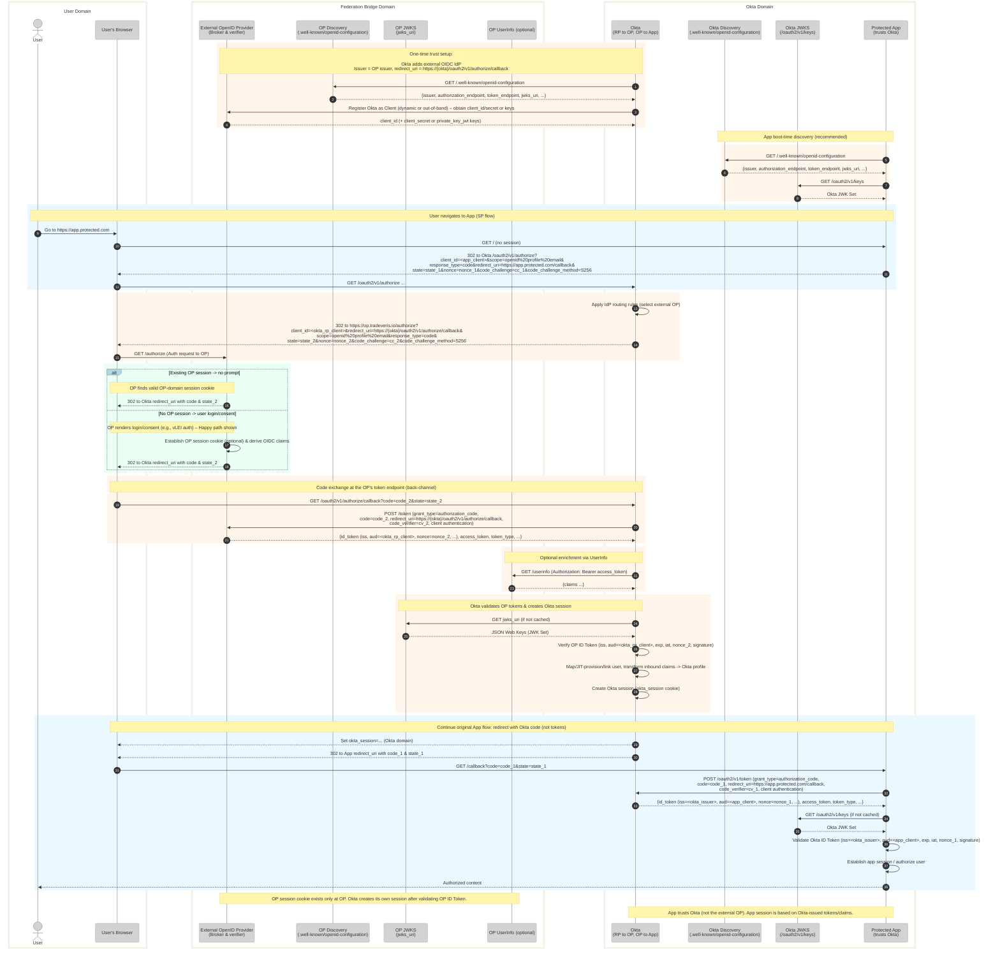

```mermaid
---
config:
  theme: base
  themeVariables:
    actorBkg: "lightgrey"
    actorBorder: "darkgrey"
    loopTextColor: "black"
    labelBoxBkgColor: "lightblue"
    labelBoxBorderColor: "grey"
---

sequenceDiagram
    autonumber
    %% === Swimlanes ===
    box User Domain
        actor User
        participant Browser as User's Browser
    end
    box Federation Bridge Domain<br><br>
        participant OP as External OpenID Provider<br>(Broker & verifier)
        participant Conf as OP Discovery<br>(.well-known/openid-configuration)
        participant JWKS as OP JWKS<br>(jwks_uri)
        participant UserInfo as OP UserInfo (optional)
    end
    box Okta Domain<br><br>
        participant Okta as Okta<br>(RP to OP, OP to App)
        participant OktaConf as Okta Discovery<br>(.well-known/openid-configuration)
        participant OktaJWKS as Okta JWKS<br>(/oauth2/v1/keys)
        participant App as Protected App<br>(trusts Okta)
    end

    %% One-time trust setup (out of band)
    rect rgba(255, 245, 235, 1)
    Note over Okta,OP: One-time trust setup:<br><br>Okta adds external OIDC IdP<br>Issuer = OP issuer, redirect_uri = https://{okta}/oauth2/v1/authorize/callback
    Okta->>Conf: GET /.well-known/openid-configuration
    Conf-->>Okta: {issuer, authorization_endpoint, token_endpoint, jwks_uri, ...}
    Okta->>OP: Register Okta as Client (dynamic or out-of-band) – obtain client_id/secret or keys
    OP-->>Okta: client_id (+ client_secret or private_key_jwt keys)
    end

    %% App boot-time discovery (recommended)
    Note over OktaConf,App: App boot-time discovery (recommended)
    rect rgba(255, 245, 235, 1)
    App->>OktaConf: GET /.well-known/openid-configuration
    OktaConf-->>App: {issuer, authorization_endpoint, token_endpoint, jwks_uri, ...}
    App->>OktaJWKS: GET /oauth2/v1/keys
    OktaJWKS-->>App: Okta JWK Set
    end

    %% SP-initiated login begins (App -> Okta)
    rect rgba(235, 248, 255, 1)
    Note over User,App: User navigates to App (SP flow)
    User->>Browser: Go to https://app.protected.com
    Browser->>App: GET / (no session)
    App-->>Browser: 302 to Okta /oauth2/v1/authorize?<br>client_id=<app_client>&scope=openid%20profile%20email&<br>response_type=code&redirect_uri=https://app.protected.com/callback&<br>state=state_1&nonce=nonce_1&code_challenge=cc_1&code_challenge_method=S256
    Browser->>Okta: GET /oauth2/v1/authorize ...
    end

    %% Okta routes to external OP (Okta -> OP)
    rect rgba(255, 245, 235, 1)
    Okta->>Okta: Apply IdP routing rules (select external OP)
    Okta-->>Browser: 302 to https://op.tradeveris.io/authorize?<br>client_id=<okta_rp_client>&redirect_uri=https://{okta}/oauth2/v1/authorize/callback&<br>scope=openid%20profile%20email&response_type=code&<br>state=state_2&nonce=nonce_2&code_challenge=cc_2&code_challenge_method=S256
    Browser->>OP: GET /authorize (Auth request to OP)
    end

    %% -------- Branch: OP session present vs not present --------
    rect rgb(235,255,245)
    alt Existing OP session -> no prompt
        Note over OP,Browser: OP finds valid OP-domain session cookie
        OP-->>Browser: 302 to Okta redirect_uri with code & state_2
    else No OP session -> user login/consent
        Note over OP,Browser: OP renders login/consent (e.g., vLEI auth) – Happy path shown
        OP->>OP: Establish OP session cookie (optional) & derive OIDC claims
        OP-->>Browser: 302 to Okta redirect_uri with code & state_2
    end
    end

    %% Code exchange at the OP's token endpoint (back-channel)
    rect rgba(255, 245, 235, 1)
    Note over Browser, Okta: Code exchange at the OP's token endpoint (back-channel)
    Browser->>Okta: GET /oauth2/v1/authorize/callback?code=code_2&state=state_2
    Okta->>OP: POST /token (grant_type=authorization_code,<br>code=code_2, redirect_uri=https://{okta}/oauth2/v1/authorize/callback,<br>code_verifier=cv_2, client authentication)
    OP-->>Okta: {id_token (iss, aud=<okta_rp_client>, nonce=nonce_2, ...), access_token, token_type, ...}
    end

    %% Optional enrichment via UserInfo
    rect rgba(255, 245, 235, 1)
    Note over Okta,UserInfo: Optional enrichment via UserInfo
    Okta->>UserInfo: GET /userinfo (Authorization: Bearer access_token)
    UserInfo-->>Okta: {claims ...}
    end

    %% Okta validates OP tokens & creates Okta session
    rect rgba(255, 245, 235, 1)
    Note over Okta,JWKS: Okta validates OP tokens & creates Okta session
    Okta->>JWKS: GET jwks_uri (if not cached)
    JWKS-->>Okta: JSON Web Keys (JWK Set)
    Okta->>Okta: Verify OP ID Token (iss, aud=<okta_rp_client>, exp, iat, nonce_2, signature)
    Okta->>Okta: Map/JIT-provision/link user, transform inbound claims -> Okta profile
    Okta->>Okta: Create Okta session (okta_session cookie)
    end

    %% Continue original App flow: redirect with Okta code (not tokens)
    rect rgba(235, 248, 255, 1)
    Note over Browser, App: Continue original App flow: redirect with Okta code (not tokens)
    Okta-->>Browser: Set okta_session=... (Okta domain)
    Okta-->>Browser: 302 to App redirect_uri with code_1 & state_1
    Browser->>App: GET /callback?code=code_1&state=state_1

    %% App exchanges code with Okta (back-channel) + validates
    App->>Okta: POST /oauth2/v1/token (grant_type=authorization_code,<br>code=code_1, redirect_uri=https://app.protected.com/callback,<br>code_verifier=cv_1, client authentication)
    Okta-->>App: {id_token (iss=<okta_issuer>, aud=<app_client>, nonce=nonce_1, ...), access_token, token_type, ...}
    App->>OktaJWKS: GET /oauth2/v1/keys (if not cached)
    OktaJWKS-->>App: Okta JWK Set
    App->>App: Validate Okta ID Token (iss=<okta_issuer>, aud=<app_client>, exp, iat, nonce_1, signature)
    App->>App: Establish app session / authorize user
    App-->>User: Authorized content
    end

    %% Session notes
    Note over OP,UserInfo: OP session cookie exists only at OP. Okta creates its own session after validating OP ID Token.
    Note over App,Okta: App trusts Okta (not the external OP). App session is based on Okta-issued tokens/claims.
```