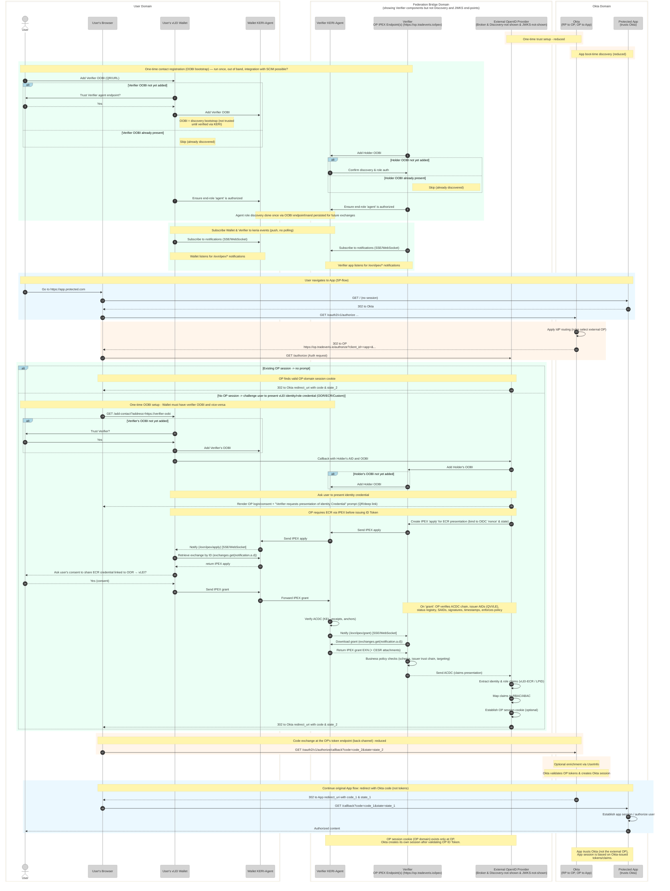

```mermaid
---
config:
  theme: base
  themeVariables:
    actorBkg: "lightgrey"
    actorBorder: "darkgrey"
    loopTextColor: "black"
    labelBoxBkgColor: "lightblue"
    labelBoxBorderColor: "grey"
---

sequenceDiagram
    autonumber
    %% === Swimlanes ===
    box User Domain<br><br>
        actor User
        participant Browser as User's Browser
        participant Wallet as User's vLEI Wallet
        participant HolderKeria as Wallet KERI-Agent
    end
    box Federation Bridge Domain<br>(showing Verifier components but not Discovery and JWKS end-points)<br><br>
        participant VerifierKeria as Verifier KERI-Agent
        participant Verifier as Verifier<br>OP IPEX Endpoint(s) (https://op.tradeveris.io/ipex)
        participant OP as External OpenID Provider<br>(Broker & Discovery-not-shown & JWKS-not-shown)
    end
    box Okta Domain<br><br>
        participant Okta as Okta<br>(RP to OP, OP to App)
        participant App as Protected App<br>(trusts Okta)
    end

    %% =========================================================
    %% One-time trust setup (out of band)
    %% =========================================================
    rect rgba(255, 245, 235, 1)
    Note over Okta,OP: One-time trust setup - reduced
    end %%rect

    %% App boot-time discovery (recommended)
    rect rgba(255, 245, 235, 1)
    Note over Okta,App: App boot-time discovery (reduced)
    end

    %% =========================================================
    %% One-time contact registration (OOBI bootstrap) — run once, out of band, integration with SCIM?
    %% =========================================================
    rect rgba(235,255,245)
    note over User,Verifier:One-time contact registration (OOBI bootstrap) — run once, out of band, integration with SCIM possible?

    %% Holder adds Verifier's OOBI (discover/verifies endpoint/roles)
    User->>Wallet: Add Verifier OOBI (QR/URL)
    alt Verifier OOBI not yet added
        Wallet->>User: Trust Verifier agent endpoint?
        User-->>Wallet: Yes
        Wallet->>HolderKeria: Add Verifier OOBI
        Note right of Wallet: OOBI = discovery bootstrap (not trusted <br/>until verified via KERI)
    else Verifier OOBI already present
        Note right of Wallet: Skip (already discovered)
    end

    %% Verifier adds Holder's OOBI (discover/verifies endpoint/roles)
    Verifier->>VerifierKeria: Add Holder OOBI
    alt Holder OOBI not yet added
        VerifierKeria->>Verifier: Confirm discovery & role auth
    else Holder OOBI already present
        Note right of Verifier: Skip (already discovered)
    end

    %% Optional: ensure end-role 'agent' authorization is present
    Wallet->>HolderKeria: Ensure end-role 'agent' is authorized
    Verifier->>VerifierKeria: Ensure end-role 'agent' is authorized
    Note over HolderKeria,VerifierKeria: Agent role discovery done once via OOBI endpoint\nand persisted for future exchanges

    end %%rect

    %% =========================================================
    %% Subscribe Wallet & Verifier to keria events (push, no polling)
    %% =========================================================
    rect rgba(235,255,245)
    Note over Wallet,VerifierKeria: Subscribe Wallet & Verifier to keria events (push, no polling)
    Wallet->>HolderKeria: Subscribe to notifications (SSE/WebSocket)
    Verifier->>VerifierKeria: Subscribe to notifications (SSE/WebSocket)
    Note over Wallet,HolderKeria: Wallet listens for /exn/ipex/* notifications
    Note over Verifier,VerifierKeria: Verifier app listens for /exn/ipex/* notifications
    end

    %% =========================================================
    %% REUSABLE FLOW — presentation request via IPEX + OIDC
    %% =========================================================
    
    %% SP-initiated login begins
    rect rgba(235, 248, 255, 1)
    Note over User,App: User navigates to App (SP-flow)
    User->>Browser: Go to https://app.protected.com    
    Browser->>App: GET / (no session)
    App-->>Browser: 302 to Okta
    Browser->>Okta: GET /oauth2/v1/authorize ...
    end %%rect

    %% Okta routes to external OP 
    rect rgba(255, 245, 235, 1)
    Okta->>Okta: Apply IdP routing (rules select external OP)
    Okta-->>Browser: 302 to OP <br>https://op.tradeveris.io/authorize?client_id=<app>&...
    Browser->>OP: GET /authorize (Auth request)
    end %%rect

    %% -------- Branch: OP session present vs not present --------
    rect rgba(235,255,245) 
    alt Existing OP session -> no prompt
        Note over OP,Browser: OP finds valid OP-domain session cookie
        OP-->>Browser: 302 to Okta redirect_uri with code & state_2
    else No OP session -> challenge user to present vLEI identity/role credential (OOR/ECR/Custom)

        %% One-time establish contact - Exchange Wallet and Verifier OOBI's        
        Note over User,VerifierKeria: One-time OOBI setup - Wallet must have verifier OOBI and vice-versa
        Browser->>Wallet: GET /add-contact?address=https://verifier-oobi
        alt Verifier's OOBI not yet added
            Wallet->>User: Trust Verifier?
            User->>Wallet: Yes
            Wallet->>HolderKeria: Add Verifier's OOBI
        end
        Wallet->>OP: Callback with Holder's AID and OOBI
        OP->>Verifier: Add Holder's OOBI
        alt Holder's OOBI not yet added
            Verifier->>VerifierKeria: Add Holder OOBI
        end

        %% ask user to present identity credential - can also be asked before OOBI exchange
        Note over OP,Wallet: Ask user to present identity credential
        OP-->>Browser: Render OP login/consent + "Verifier requests presentation of identity Credential" prompt (QR/deep link)

        Note over OP,Wallet: OP requires ECR via IPEX before issuing ID Token
        OP->>Verifier: Create IPEX 'apply' for ECR presentation (bind to OIDC 'nonce' & state)
        Verifier->>VerifierKeria: Send IPEX apply

        %% Holder side: receive IPEX apply via push notification
        VerifierKeria->>HolderKeria: Send IPEX apply
        HolderKeria-->>Wallet: Notify (/exn/ipex/apply) [SSE/WebSocket]
        Wallet->>HolderKeria: Retrieve exchange by ID (exchanges.get(notification.a.d))
        HolderKeria-->>Wallet: return IPEX apply

        % Holder discloses credential (grant)
        Wallet-->>User: Ask user's consent to share ECR credential linked to OOR → vLEI?
        User-->>Wallet: Yes (consent)
        Wallet->>HolderKeria: Send IPEX grant
        HolderKeria->>VerifierKeria: Forward IPEX grant

        %% Verifier side: cryptographic verification + push notify to app        
        Note over Verifier,OP: On 'grant': OP verifies ACDC chain, issuer AIDs (QVI/LE),<br>status registry, SAIDs, signatures, timestamps, enforces policy
        VerifierKeria->>VerifierKeria: Verify ACDC (KEL, receipts, anchors)
        VerifierKeria-->>Verifier: Notify (/exn/ipex/grant) [SSE/WebSocket]
        Verifier->>VerifierKeria: Download grant (exchanges.get(notification.a.d))
        VerifierKeria-->>Verifier: Return IPEX grant EXN (+ CESR attachments)
        Verifier->>Verifier: Business policy checks (schema, issuer trust chain, targeting)

        %% Broker receives verified presentation for OIDC mapping
        Verifier-->>OP: Send ACDC (claims presentation)
        OP->>OP: Extract identity & role claims (vLEI-ECR / LPID)
        OP->>OP: Map claims to RBAC/ABAC        

        %% OP completes login after successful IPEX/ECR verification
        OP->>OP: Establish OP session cookie (optional)
        OP-->>Browser: 302 to Okta redirect_uri with code & state_2
    end %%else
    end %%rect

    %% Code exchange at the OP's token endpoint (bach-channel) - reduced
    rect rgba(255, 245, 235, 1)
    Note over Browser, Okta: Code exchange at the OP's token endpoint (back-channel) -reduced
    Browser->>Okta: GET /oauth2/v1/authorize/callback?code=code_2&state=state_2
    end

    %% Optional enrichment via UserInfo
    rect rgba(255, 245, 235, 1)
    Note over Okta,Okta: Optional enrichment via UserInfo
  
    %% Okta validates OP tokens & creates Okta session
    Note over Okta,Okta: Okta validates OP tokens & creates Okta session
    end

    %% Continue original App flow: redirect with Okta code (not tokens)
    rect rgba(235, 248, 255, 1)
    Note over Browser, App: Continue original App flow: redirect with Okta code (not tokens)
    Okta-->>Browser: 302 to App redirect_uri with code_1 & state_1
    Browser->>App: GET /callback?code=code_1&state=state_1

    %% App exchanges code with Okta (back-channel) + validates
    App->>App: Establish app session / authorize user
    App-->>User: Authorized content
    end

    %% Session notes
    Note over OP,VerifierKeria: OP session cookie (OP domain) exists only at OP. <br>Okta creates its own session after validating OP ID Token.
    Note over App,Okta: App trusts Okta (not the external OP), <br>App session is based on Okta-issued <br>tokens/claims.
```