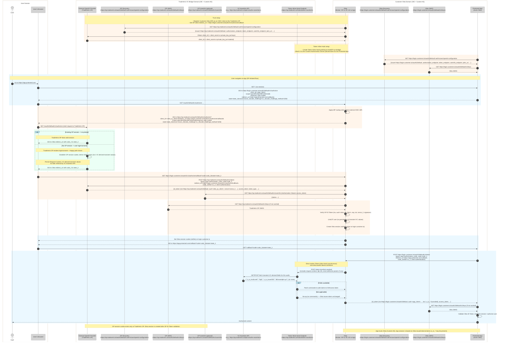

```mermaid
---
config:
  theme: base
  themeVariables:
    actorBkg: "lightgrey"
    actorBorder: "darkgrey"
    loopTextColor: "black"
    labelBoxBkgColor: "lightblue"
    labelBoxBorderColor: "grey"
---


sequenceDiagram
    autonumber
    %% === Swimlanes ===
    box User Domain
        actor User
        participant Browser as User's Browser
    end

    box TradeVeris VC-Bridge Domain (OIE + Custom AS)<br><br>
        participant OP as External OpenID Provider<br>(TradeVeris OP)
        participant OPConf as OP Discovery<br>(https://op.tradeveris.io/oauth2/default/.well-known/openid-configuration)
        participant OPJWKS as OP JWKS<br>(https://op.tradeveris.io/oauth2/default/v1/keys)
        participant OPUserInfo as OP UserInfo (optional)<br>(https://op.tradeveris.io/oauth2/default/v1/userinfo)
        participant VCAPI as VC Assertion API<br>(e.g., https://op.tradeveris.io/api/v1/authn-assertions)
        participant HookEP as Token Inline Hook Endpoint<br>(https://op.tradeveris.io/hooks/token-transform)
    end

    box Customer Okta Domain (OIE + Custom AS)<br><br>
        participant Okta as Okta<br>(Broker: RP to OP, AS to App)
        participant OktaConf as Okta Discovery<br>(https://login.customer.io/oauth2/default/.well-known/openid-configuration)
        participant OktaJWKS as Okta JWKS<br>(https://login.customer.io/oauth2/default/v1/keys)
        participant App as Protected App<br>(trusts Okta)
    end

    %% One-time trust setup (out of band)
    rect rgba(255, 245, 235, 1)
    Note over Okta,OP: Trust setup<br><br>- Register Customer Okta (RP) as an OIDC client at the TradeVeris OP<br>- Set OP client redirect_uri = https://login.customer.io/oauth2/v1/authorize/callback
    Okta->>OPConf: GET https://op.tradeveris.io/oauth2/default/.well-known/openid-configuration
    OPConf-->>Okta: {issuer=https://op.tradeveris.io/oauth2/default, authorization_endpoint, token_endpoint, userinfo_endpoint, jwks_uri, ...}
    Okta->>OP: Obtain client_id (+ client_secret or private_key_jwt keys)
    OP-->>Okta: client_id (+ client_secret or private_key_jwt material)
    end

    %% One-time Token Inline Hook setup (out of band)
    rect rgba(255, 245, 235, 1)
    Note over Okta,HookEP: Token Inline Hook setup<br><br>- Create Token Inline Hook pointing to HookEP (vc-bridge)<br>- Attach it to the Custom Authorization Server policies/rules for the Protected App
    end

    %% App boot-time discovery (recommended)
    rect rgba(255, 245, 235, 1)
    App->>OktaConf: GET https://login.customer.io/oauth2/default/.well-known/openid-configuration
    OktaConf-->>App: {issuer=https://login.customer.io/oauth2/default, authorization_endpoint, token_endpoint, userinfo_endpoint, jwks_uri, ...}
    App->>OktaJWKS: GET https://login.customer.io/oauth2/default/v1/keys
    OktaJWKS-->>App: Okta JWKS
    end

    %% SP-initiated login begins (App -> Okta Custom AS)
    rect rgba(235, 248, 255, 1)
    Note over User,App: User navigates to App (SP-initiated flow)
    User->>Browser: Go to https://app.protected.com
    Browser->>App: GET / (no session)
    App-->>Browser: 302 to https://login.customer.io/oauth2/default/v1/authorize<br>client_id=<app_client><br>scope=openid%20profile%20email&<br>response_type=code&<br>redirect_uri=https://app.protected.com/callback&<br>state=state_1&nonce=nonce_1&code_challenge=cc_1&code_challenge_method=S256
    Browser->>Okta: GET /oauth2/default/v1/authorize ...
    end

    %% Broker redirects to external TradeVeris OP (Custom AS at OP)
    rect rgba(255, 245, 235, 1)
    Okta->>Okta: Apply IdP routing rules (select external OIDC IdP)
    Okta-->>Browser: 302 to https://op.tradeveris.io/oauth2/default/v1/authorize?<br>client_id=<okta_rp_client>&redirect_uri=https://login.customer.io/oauth2/v1/authorize/callback&<br>scope=openid%20profile%20email&response_type=code&<br>state=state_2&nonce=nonce_2&code_challenge=cc_2&code_challenge_method=S256
    Browser->>OP: GET /oauth2/default/v1/authorize (Auth request to TradeVeris OP)
    end

    %% -------- Branch: OP session present vs not present --------
    rect rgb(235,255,245)
    alt Existing OP session -> no prompt
        Note over OP,Browser: TradeVeris OP finds valid session
        OP-->>Browser: 302 to Okta redirect_uri with code_2 & state_2
    else No OP session -> user login/consent
        Note over OP,Browser: TradeVeris OP renders login/consent – Happy path shown
        OP->>OP: Establish OP session cookie, derive OIDC claims (incl. VC-derived transient values)
        Note over OP, Browser: Persist Request Context, VC-derived transient values<br>for later retrieval by VC Assertion API
        OP-->>Browser: 302 to Okta redirect_uri with code_2 & state_2
    end
    end

    %% Code exchange at TradeVeris OP (back-channel)
    rect rgba(255, 245, 235, 1)
    Browser->>Okta: GET https://login.customer.io/oauth2/v1/authorize/callback?code=code_2&state=state_2
    Okta->>OP: POST https://op.tradeveris.io/oauth2/default/v1/token<br>(grant_type=authorization_code, code=code_2,<br>redirect_uri=https://login.customer.io/oauth2/v1/authorize/callback,<br>code_verifier=cv_2, client authentication)
    OP-->>Okta: {id_token (iss=https://op.tradeveris.io/oauth2/default, aud=<okta_rp_client>, nonce=nonce_2, ...), access_token, token_type, ...}
    %% Optional enrichment via UserInfo
    Okta->>OPUserInfo: GET https://op.tradeveris.io/oauth2/default/v1/userinfo (Authorization: Bearer access_token)
    OPUserInfo-->>Okta: {claims ...}
    end

    %% Broker validates OP tokens & creates Okta session
    rect rgba(255, 245, 235, 1)
    Okta->>OPJWKS: GET https://op.tradeveris.io/oauth2/default/v1/keys (if not cached)
    OPJWKS-->>Okta: TradeVeris OP JWKS
    Okta->>Okta: Verify OP ID Token (iss, aud=<okta_rp_client>, exp, iat, nonce_2, signature)
    Okta->>Okta: Link/JIT user (no persistence of transient VC values)
    Okta->>Okta: Create Okta session (sid/idx cookie on login.customer.io)
    end

    %% Continue original App flow: redirect with Okta code (not OP tokens)
    rect rgba(235, 248, 255, 1)
    Okta-->>Browser: Set Okta session cookie (sid/idx) on login.customer.io
    Okta-->>Browser: 302 to https://app.protected.com/callback?code=code_1&state=state_1
    Browser->>App: GET /callback?code=code_1&state=state_1
    end

    %% App exchanges code with Okta Custom AS + Token Inline Hook injection
    rect rgba(235, 248, 255, 1)
    App->>Okta: POST https://login.customer.io/oauth2/default/v1/token<br>(grant_type=authorization_code, code=code_1,<br>redirect_uri=https://app.protected.com/callback,<br>code_verifier=cv_1, client authentication)

    Note over Okta,HookEP: Okta invokes Token Inline Hook (synchronous)<br>com.okta.oauth2.tokens.transform

    Okta->>HookEP: POST token-transform payload<br/>(includes request context, idp info, extra authorize params if any)
    HookEP->>VCAPI: GET/POST fetch transient VC-derived fields for this authn
    VCAPI-->>HookEP: { "x_tv_trustLevel": "high", "x_tv_issuerDid": "did:example:xyz" } (or none)
    alt Fields available
        HookEP-->>Okta: Patch commands to add claims to ID/Access token
    else Not applicable
        HookEP-->>Okta: No-op (no commands) — Okta issues token unchanged
    end

    Okta-->>App: {id_token (iss=https://login.customer.io/oauth2/default, aud=<app_client>, ... incl. x_tv_* if provided), access_token, ...}
    App->>OktaJWKS: GET https://login.customer.io/oauth2/default/v1/keys (if not cached)
    OktaJWKS-->>App: Okta JWKS
    App->>App: Validate Okta ID Token, establish session / authorize user
    App-->>User: Authorized content
    end

    %% Session notes
    Note over OP,OPUserInfo: OP session cookie exists only at TradeVeris OP. Okta session is created after OP ID Token validation.
    Note over App,Okta: App trusts Okta (Custom AS). App session is based on Okta-issued tokens/claims (x_tv_* may be present).
```